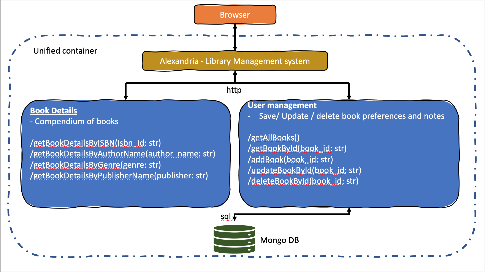

# Google Books

Google Books has a mission to digitize the world's book content and make it more discoverable on the Web. The Books API is a way to search and access that content, as well as to create and view personalization around that content.

# Building Blocks

Google Books is built upon four basic concepts:

- **Volume**: A volume represents the data that Google Books hosts about a book or magazine. It is the primary resource in the Books API. All other resources in this API either contain or annotate a volume.

- **Bookshelf**: A bookshelf is a collection of volumes. Google Books provides a set of predefined bookshelves for each user, some of which are completely managed by the user, some of which are automatically filled in based on user's activity, and some of which are mixed. Users can create, modify or delete other bookshelves, which are always filled with volumes manually. Bookshelves can be made private or public by the user.

- **Review**: A review of a volume is a combination of a star rating and/or text. A user can submit one review per volume. Reviews are also available from outside sources and are attributed appropriately.

- **Reading Position**: A reading position indicates the last read position in a volume for a user. A user can only have one reading position per volume. If the user has not opened that volume before, then the reading position does not exist. The reading position can store detailed position information down to the resolution of a word. This information is always private to the user.

# Books API Data Model

The Books API operates on two types of resources, based on the concepts described above:

- **Volume resource**: Represents a volume.
- **Bookshelf resource**: Represents a single bookshelf for a particular user.

The Books API data model is based on groups of resources, called collections:

- **Volume collection**: The volume collection, is a collection of every volume resource managed by Google Books. As such, you cannot list all volume resources, but you can list all volumes that match a set of search terms.

- **Bookshelf collection**: A bookshelf collection consists of all the bookshelf resources managed by Google Books. Bookshelves must always be referenced in the context of a specific user's library. Bookshelves can contain zero or more volumes.

# How to use the Google Books API

https://developers.google.com/books/docs/v1/using

# Alexandria - Our Application

A books management system to demonstrate GIT workflow and various stages of development
life-cycle.

Alexandria interacts with the google books API and provides functions to insert book records, update books records, delete book records and retrieve book records by various queries or parameters.

# High Level Diagram (tentative)
 

  

